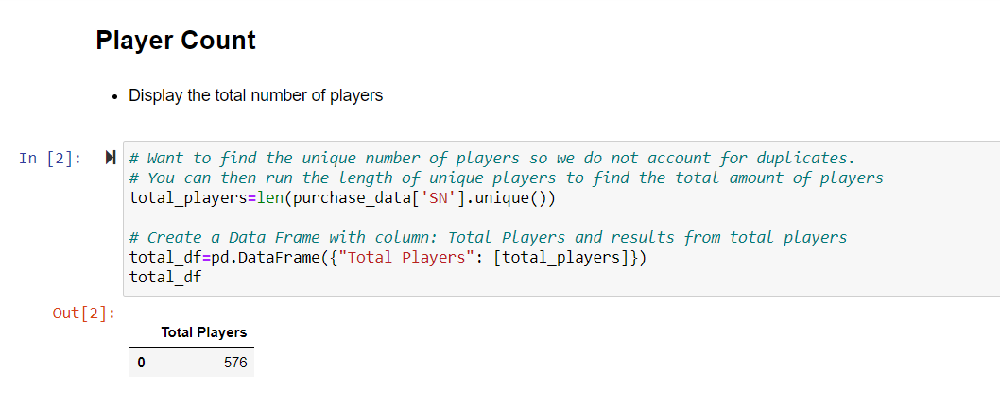
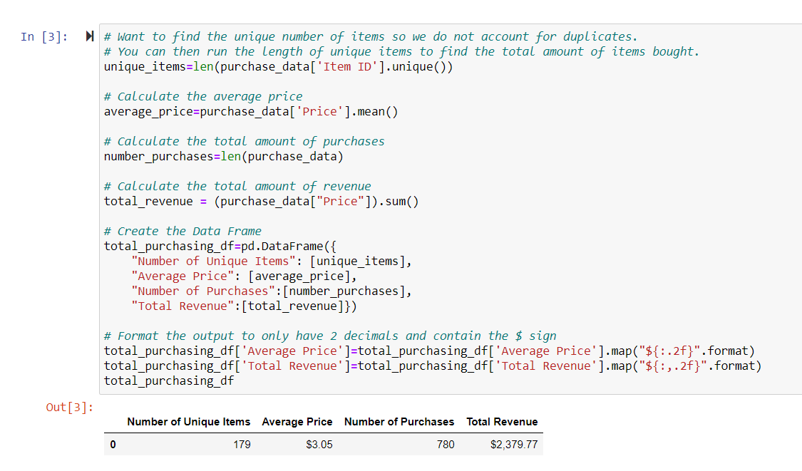
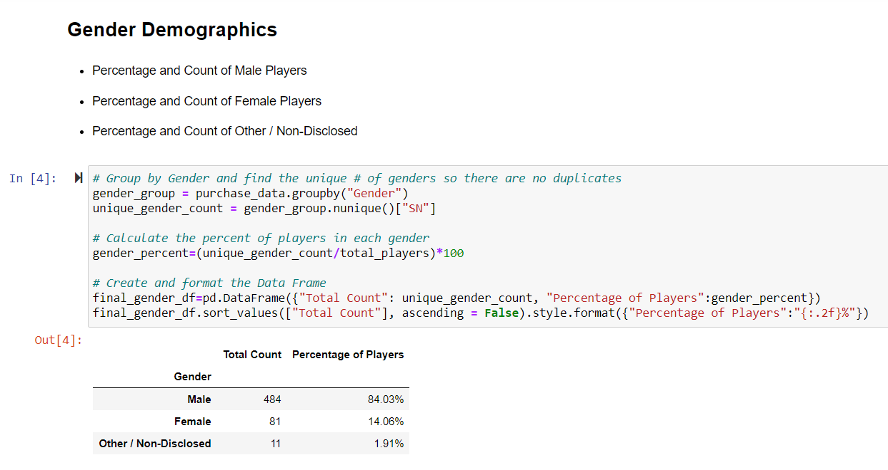
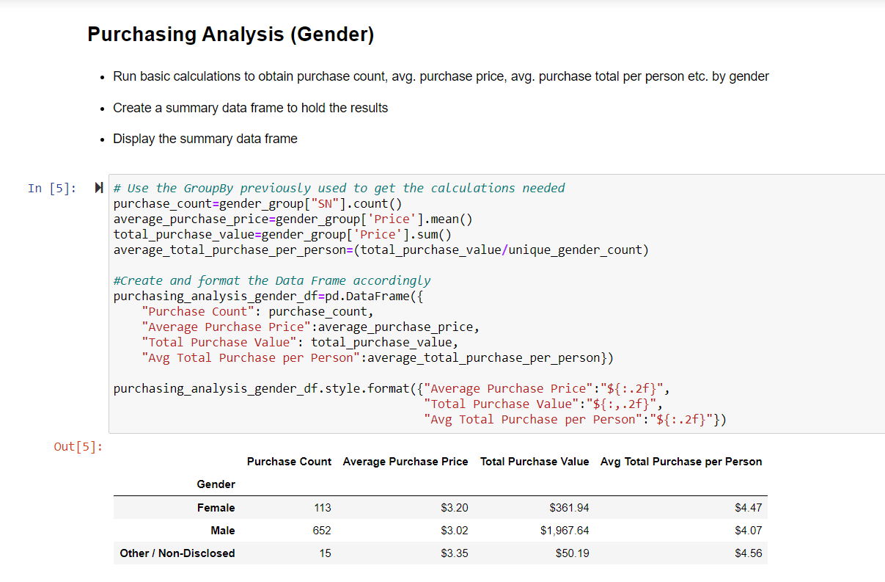
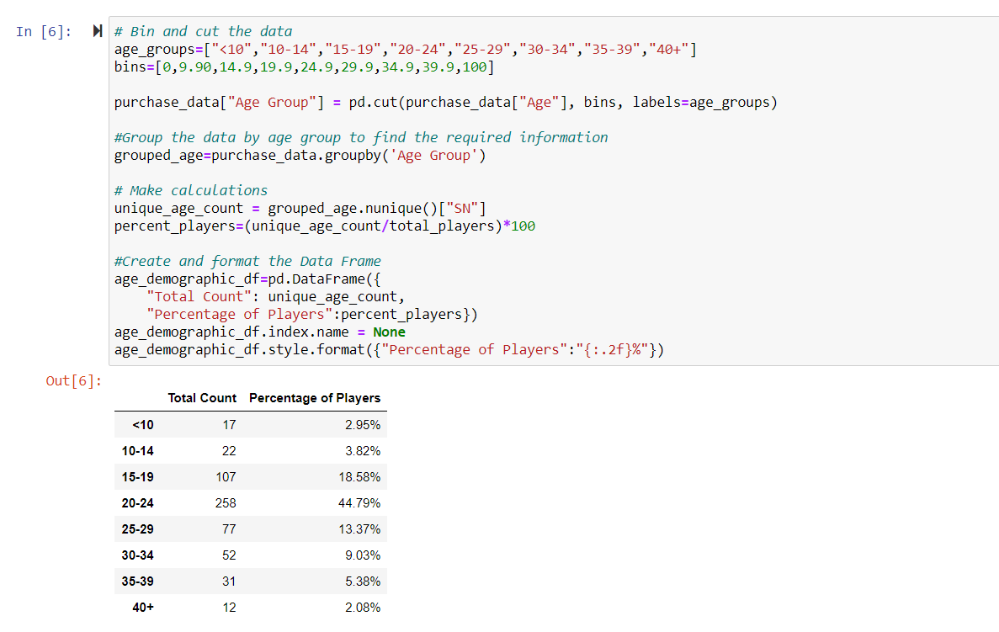
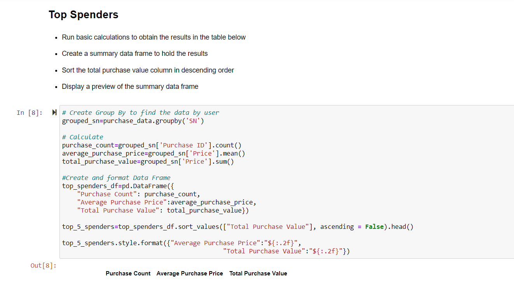
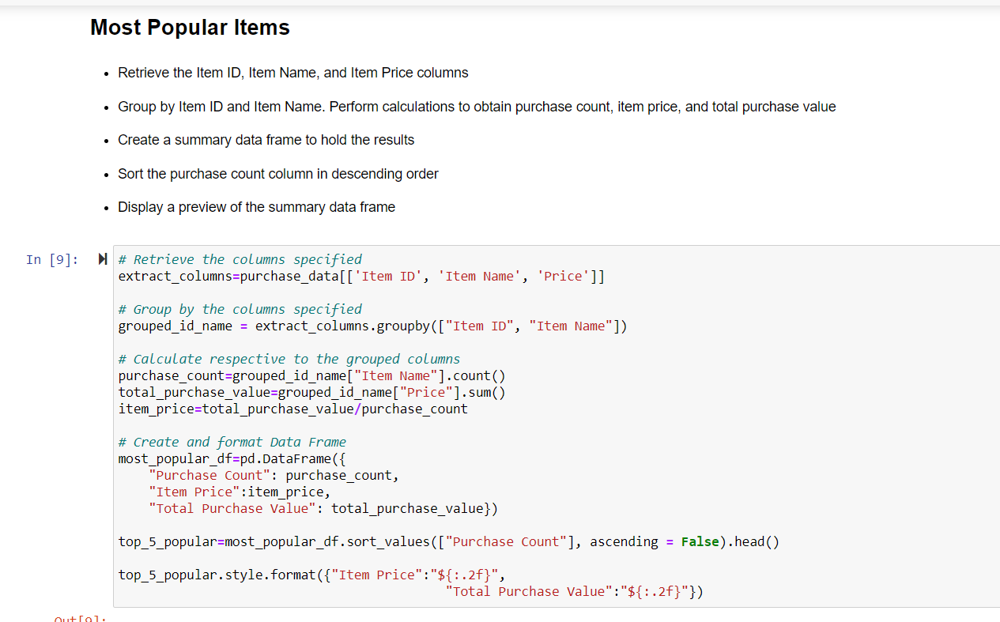
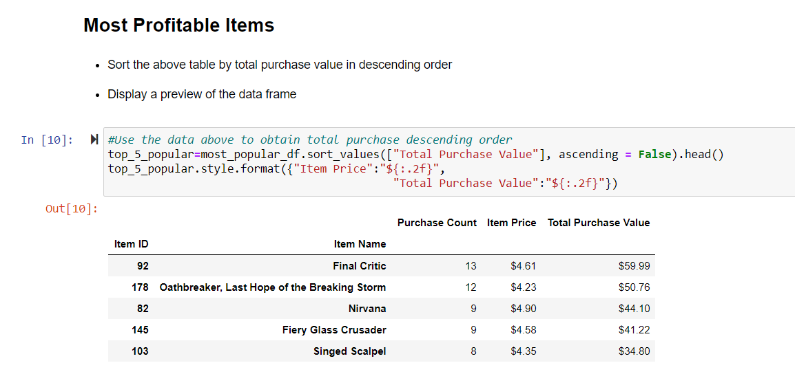

# Pandas Data Analysis - Heroes of Pymoli

- - -

I generated a report that breaks down the game's, Heroes of Pymoli, purchasing data into meaningful insights.

- - -

# Analysis on Heroes of Pymoli

1. There was a total of 780 purchases and there are 179 unique items which means that most of the items were bought more than once
2. There is a substancial gender difference of players, males dominating at 84% 
3. The two age groups that make up most of the players are 15-19 (18.58%) and 20-24 (44.79%)
4. The two age groups mentioned above are also the biggest spenders: 15-19 ($412.89) and 20-24 ($1114.06)
5. Not all of the popular items are the most profitable

- - -

## What I did:

### Player Count

* Total Number of Players

### Purchasing Analysis (Total)

* Number of Unique Items
* Average Purchase Price
* Total Number of Purchases
* Total Revenue

### Gender Demographics

* Percentage and Count of Male Players
* Percentage and Count of Female Players
* Percentage and Count of Other / Non-Disclosed

### Purchasing Analysis (Gender)

* The below each broken by gender
  * Purchase Count
  * Average Purchase Price
  * Total Purchase Value
  * Average Purchase Total per Person by Gender

  

### Age Demographics

* The below each broken into bins of 4 years (i.e. &lt;10, 10-14, 15-19, etc.)
  * Purchase Count
  * Average Purchase Price
  * Total Purchase Value
  * Average Purchase Total per Person by Age Group

  

### Top Spenders

* Identified the top 5 spenders in the game by total purchase value, then list (in a table):
  * SN
  * Purchase Count
  * Average Purchase Price
  * Total Purchase Value

  
 

### Most Popular Items

* Identified the 5 most popular items by purchase count, then listed them (in a table):
  * Item ID
  * Item Name
  * Purchase Count
  * Item Price
  * Total Purchase Value

  

### Most Profitable Items

* Identified the 5 most profitable items by total purchase value, then listed them (in a table):
  * Item ID
  * Item Name
  * Purchase Count
  * Item Price
  * Total Purchase Value

  

- - -
The data is provided by UCSD Extension: Data Science and Visualization Bootcamp.
- - -

Contact:

Email: arcebri1@gmail.com
